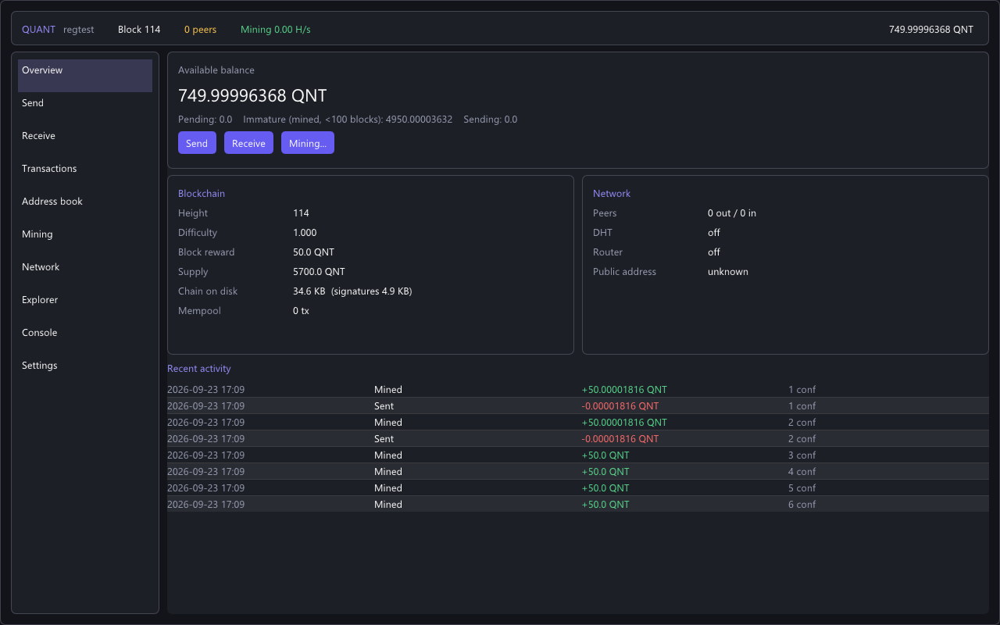
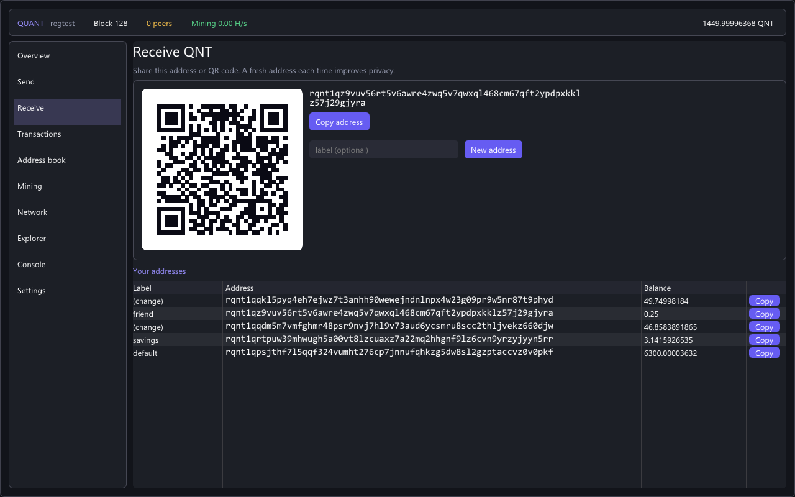
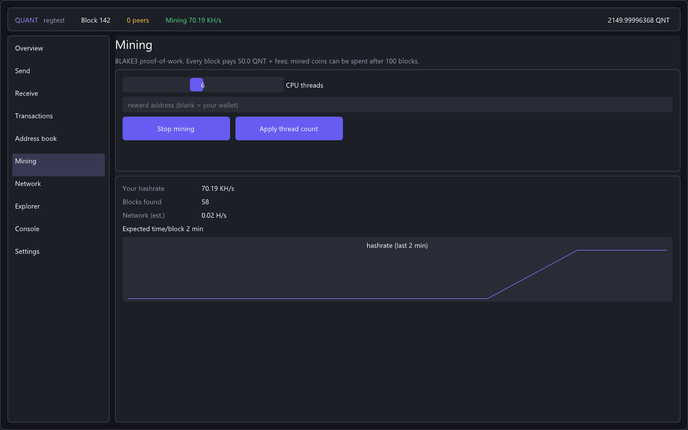
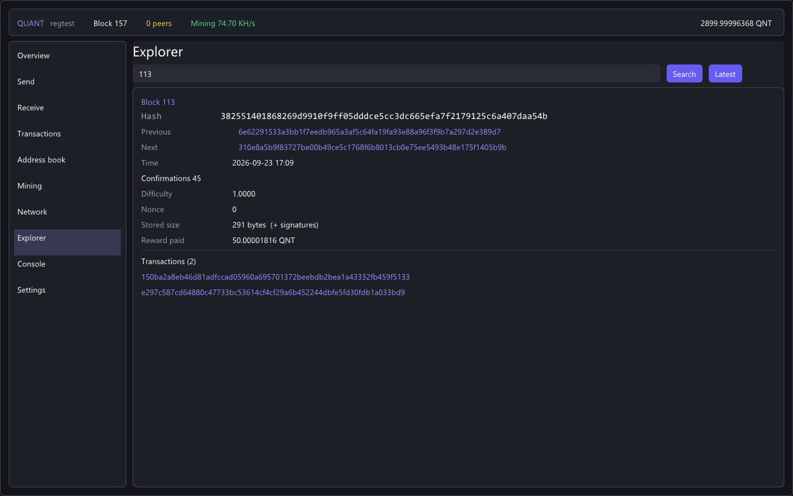

# Quant Wallet (quant-qt)

Desktop client for **Quant (QNT)**, the post-quantum cryptocurrency. It runs a full node inside
the app, with the wallet, miner, block explorer, peer view and console in one small native
window (Dear ImGui). There's no web view and no Qt dependency, so it's one ~6 MB `.exe`.



| Receive (QR) | Mining | Explorer |
|---|---|---|
|  |  |  |

## Features
- **Wallet:** 24 seed words (same words as quantd and the Termux phone wallet), encrypted wallet
  file, send with a confirmation dialog and fee preview, receive with a QR code, labels, history,
  address book
- **Miner:** BLAKE3 CPU mining with a thread slider, live hashrate graph, and an estimate of time
  to your next block
- **Full node:** headers-first sync, signature pruning, BitTorrent-DHT + LAN peer discovery,
  UPnP
- **Explorer:** search any block height, block hash, txid or address; click through links
- **Console:** every `quant-cli` command, with Tab completion and history
- **Quantum emergency:** sweep all funds with the SPHINCS+ backup key (`sweep <addr> true`)

## Build

The node code comes from [quant-core](https://github.com/tehrealaju-svg/quant-core) (git submodule).

```
git clone --recursive https://github.com/tehrealaju-svg/quant-qt
cd quant-qt
cmake -S . -B build -G "MinGW Makefiles"     # Linux / Pi: cmake -S . -B build
cmake --build build -j
build/quant-qt
```
Linux / Raspberry Pi desktop needs `sudo apt install build-essential cmake libgl1-mesa-dev xorg-dev`.

Options: `-regtest` (local instant-block chain), `-datadir=DIR`, `-addnode=IP:PORT`,
`-shots=DIR` (scripted screenshots of every page, used to produce the images above).

> ⚠️ Experimental software, not audited. Defaults to testnet until mainnet launches.
